# Jarkom-Modul-1-D09-2021

Nama Anggota | NRP
------------------- | --------------		
Dias Tri Kurniasari | 05111940000035
Nazhwa Ameera H | 05111940000133
Nur Moh. Ihsanuddien | 05111940000142

## List of Contents :
- [No 1](#no-1)
- [No 2](#no-2)
- [No 3](#no-3)
- [No 4](#no-4)
- [No 5](#no-5)
- [No 6](#no-6)
- [No 7](#no-7)
- [No 8](#no-8)
- [No 9](#no-9)
- [No 10](#no-10)
- [No 11](#no-11)
- [No 12](#no-12)
- [No 13](#no-13)
- [No 14](#no-14)
- [No 15](#no-15)
- [Kendala](#kendala)

## NO 1

## NO 2
Untuk menemukan web-web yang menggunakan basic authentication method, digunakan filter `http.authbasic`
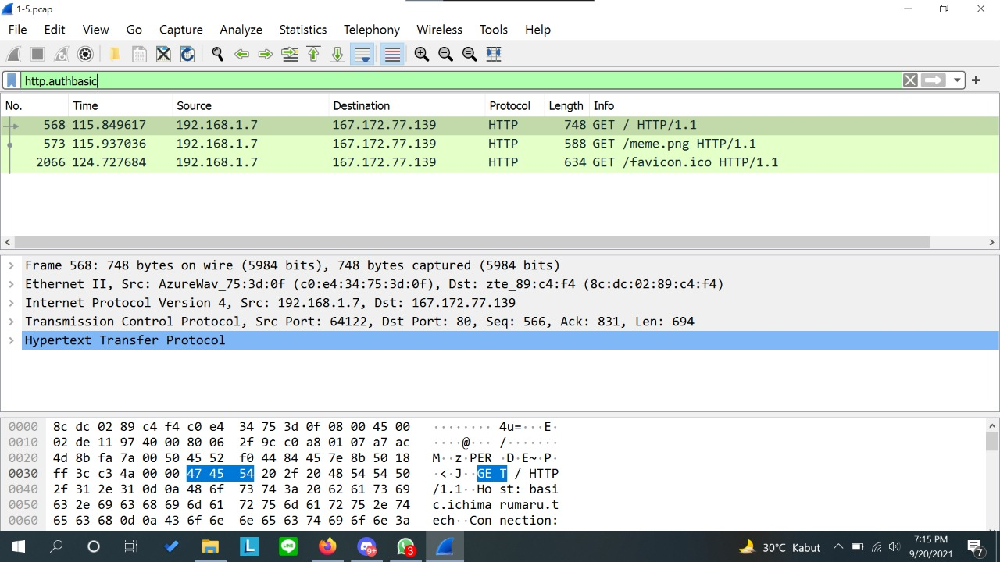

## NO 3

## NO 4

## NO 5

## NO 6

## NO 7

## NO 8

## NO 9
Untuk menyimpan dan membuka file dari `file *.pcapng` yang telah disediakan terdapat beberapa langkah. 
- Menggunakan display filter expression : `ftp-data`
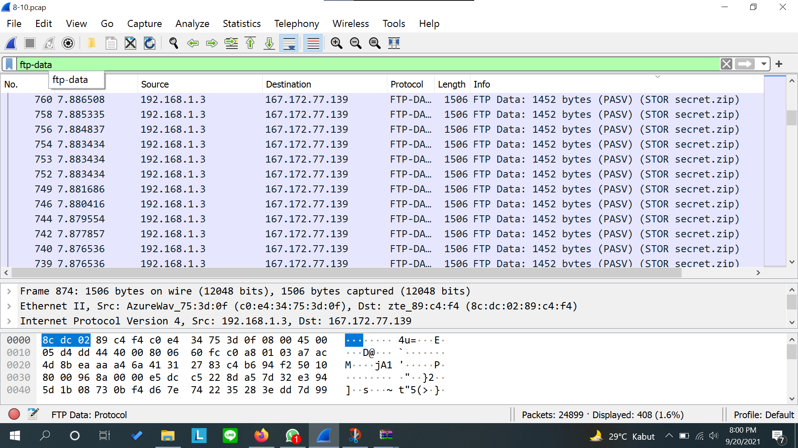

- Pilih info pertama yang bertuliskan `secret.zip` → klik kanan → follow → tcp stream
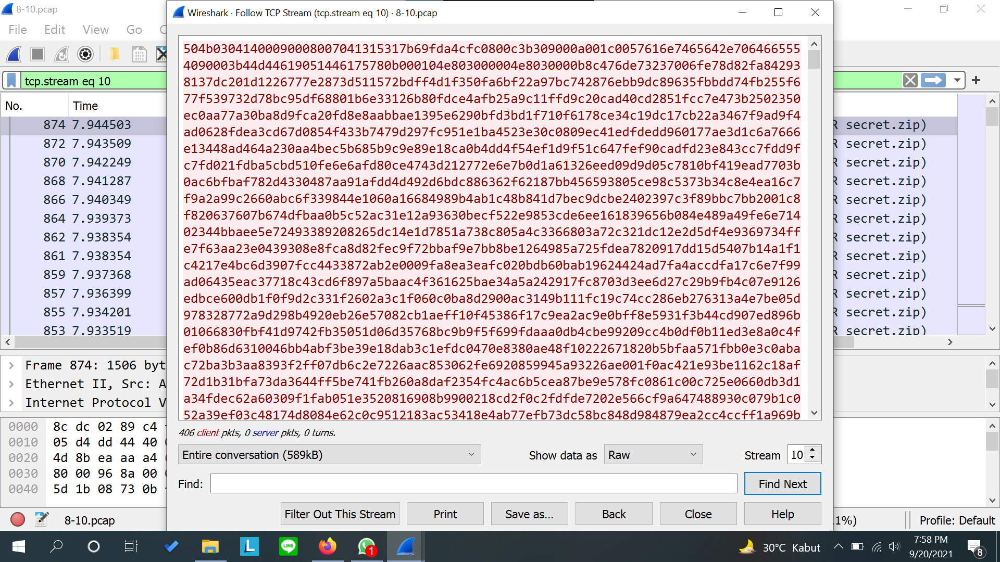

- Ubah Show data as `ASCII` menjadi `RAW` kemudian save as dengan mana file `secret.zip`
- Buka file `secret.zip` di directory, kemudian buka file `Wanted.pdf`
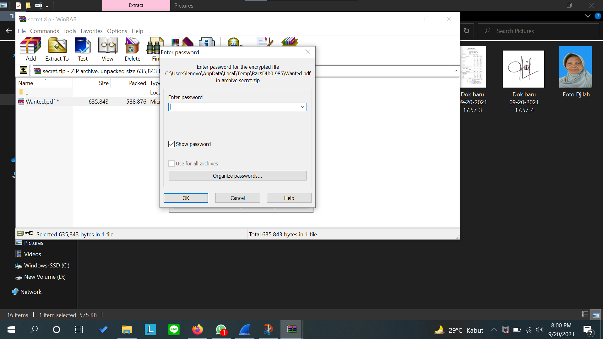

## No 10
Untuk membuka file `Wanted.pdf` harus mencari password terlebih dahulu dari file `history.txt`. Langkah-langkah yang dapat dilakukan yaitu :
- Menggunakan display filter expression : `ftp-data`
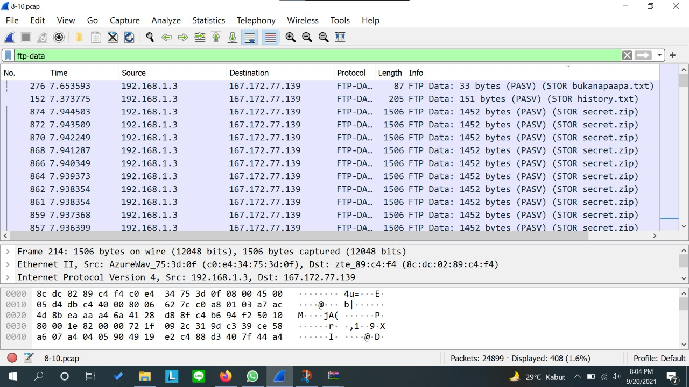

- Pilih info pertama yang bertuliskan `history.txt` → klik kanan → follow → tcp stream
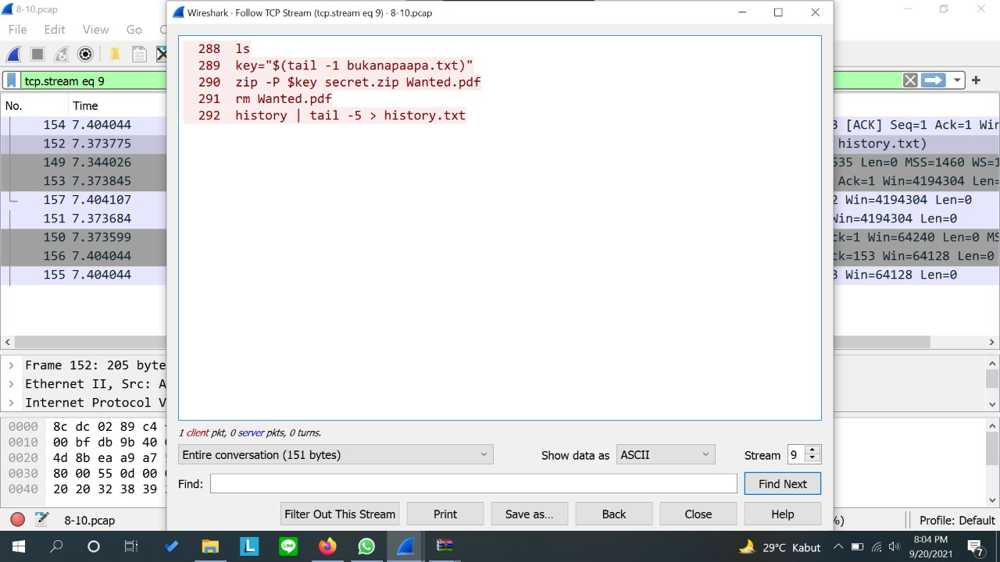

- Kemudian terdapat clue dalam file tersebut yaitu `bukanapaapa.txt`
- Menggunakan display filter expression : `ftp-data` untuk membuka file `bukanapaapa.txt`
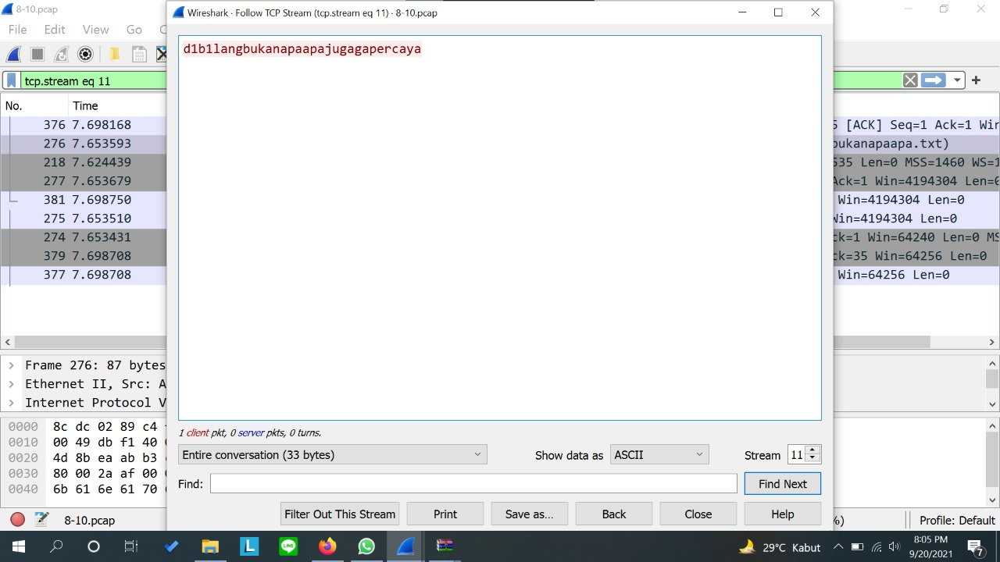

- Memasukan isi `bukanapaapa.txt` ke password file `Wanted.pdf`
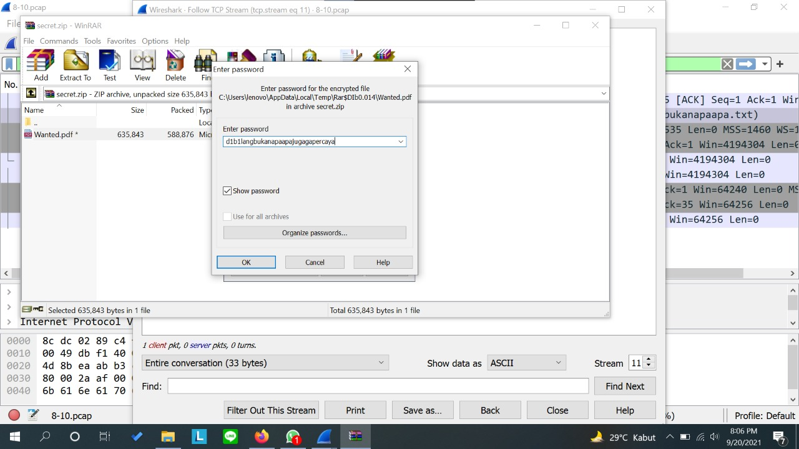

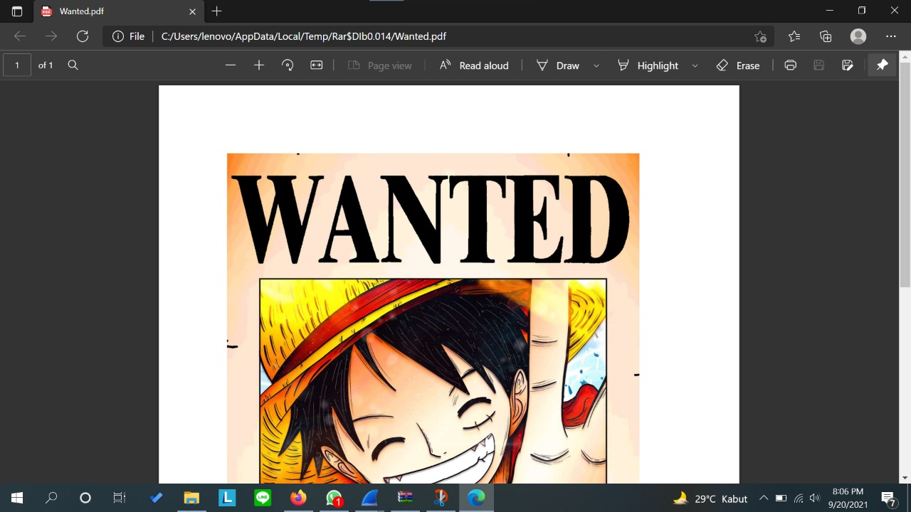

## No 11
Untuk mengambil paket yang berasal dari `port 80` digunakan capture filter dengan expression `src port 80` dan klik start
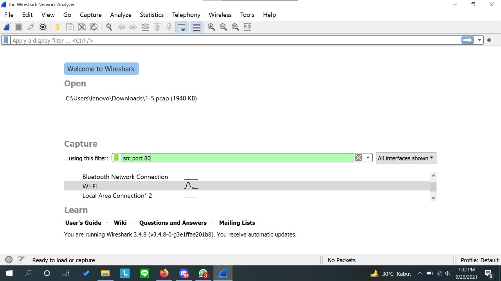

kemudian buka link website dengan alamat `http` dan hasilnya sebagai berikut :
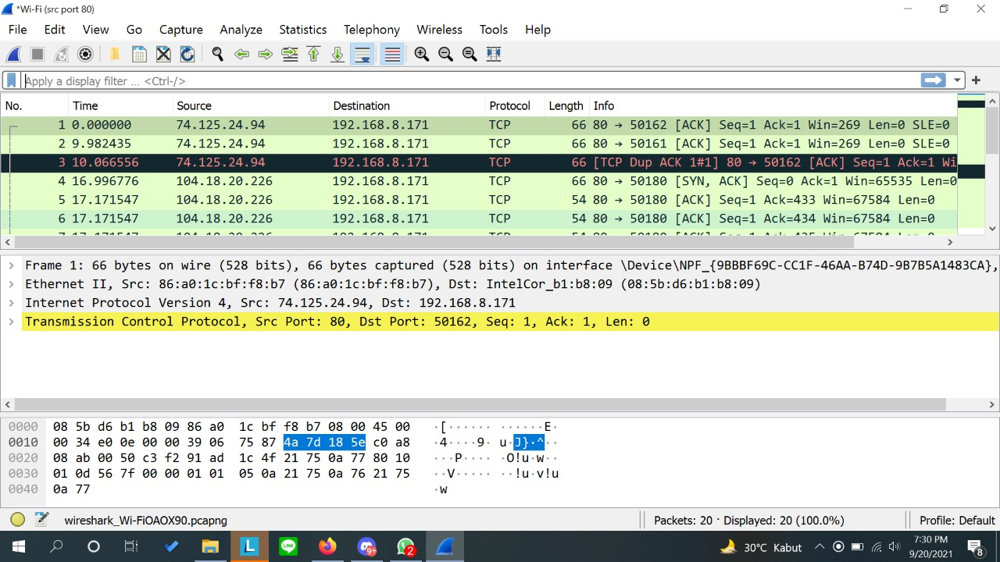

## No 12
Untuk mengambil paket yang mengandung `port 21` digunakan capture filter dengan expression `port 21` dan klik start
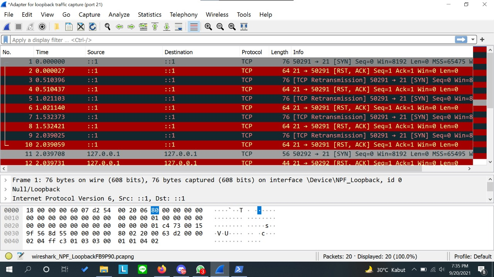

kemudian buka windows powershell dan ketik `ftp localhost` dan hasilnya sebagai berikut :
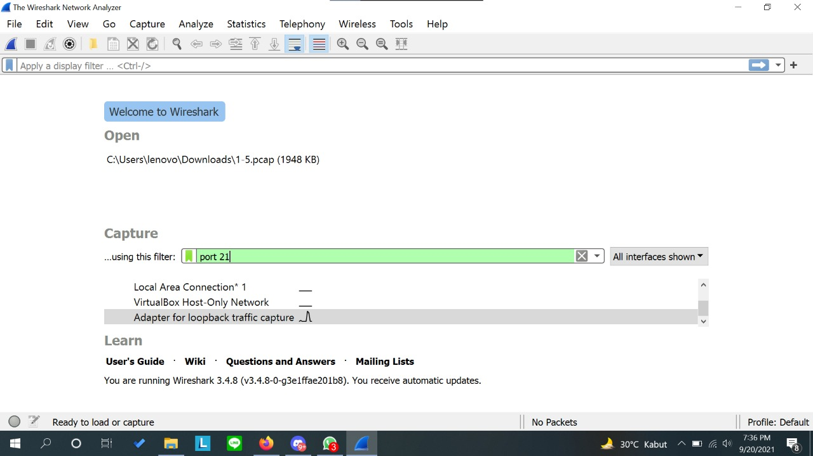

## No 13
Untuk menampilkan paket yang menuju `port 443` digunakan capture filter dengan expression `dst port 443` dan klik start

kemudian buka link website dengan alamat `https` dan hasilnya sebagai berikut :
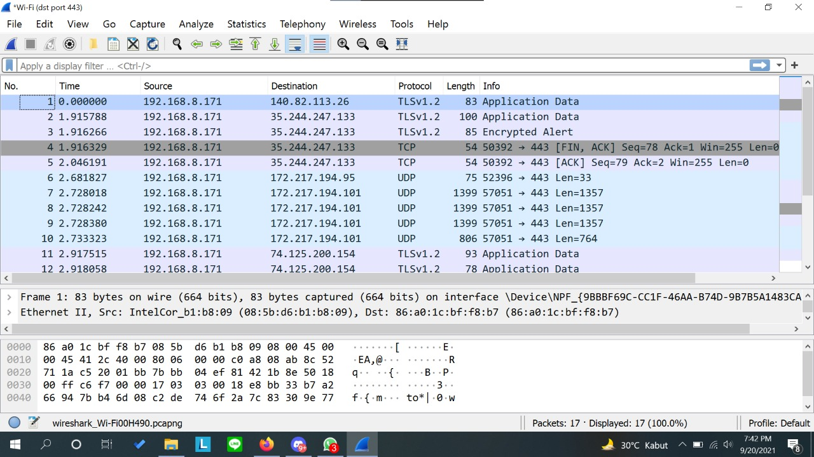

## No 14
Untuk mengambil paket yang tujuannya ke `kemenag.go.id` digunakan capture filter dengan expression `dst host kemenag.go,id` dan klik start
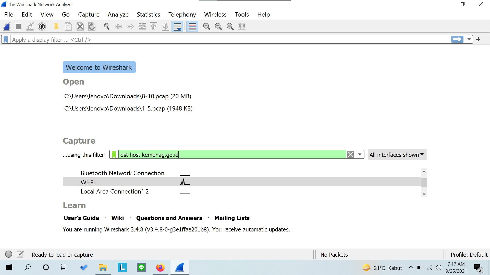

kemudian buka link website dengan alamat `kemenag.go.id` dan hasilnya sebagai berikut :

## No 15

## Kendala
- Kesalahan pada nomor 14 yaitu awalnya menggunakan capture filter `host kemenag.go.id`.
- Nomer 15 dengan filter expression sama tapi tidak dapat menampilkan hasil pada laptop anggota yang lain. 

