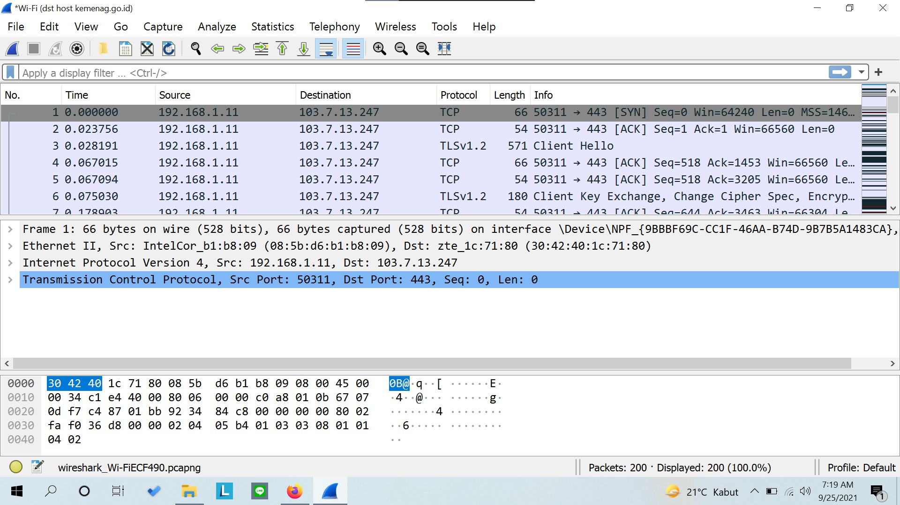

# Jarkom-Modul-1-D09-2021

Nama Anggota | NRP
------------------- | --------------		
Dias Tri Kurniasari | 05111940000035
Nazhwa Ameera H | 05111940000133
Nur Moh. Ihsanuddien | 05111940000142

## List of Contents :
- [No 1](#no-1)
- [No 2](#no-2)
- [No 3](#no-3)
- [No 4](#no-4)
- [No 5](#no-5)
- [No 6](#no-6)
- [No 7](#no-7)
- [No 8](#no-8)
- [No 9](#no-9)
- [No 10](#no-10)
- [No 11](#no-11)
- [No 12](#no-12)
- [No 13](#no-13)
- [No 14](#no-14)
- [No 15](#no-15)
- [Kendala](#kendala)

## NO 1
### Sebutkan webserver yang digunakan pada "ichimarumaru.tech"!
Webserver yang digunakan pada ichimaru.tech dapat dilihat dengan langkah-langkah berikut.

- Display Filter lalu pilih baris paling atas. Klik kanan, pilih follow TCP Stream.

- Find server. Hasilnya: Server: nginx/1.18.0 (Ubuntu)

## NO 2
Untuk menemukan web-web yang menggunakan basic authentication method, digunakan filter `http.authbasic`

## NO 3
### Ikuti perintah di basic.ichimarumaru.tech! Username dan password bisa didapatkan dari file .pcapng!

- Display Filter : http.host contains “basic.ichimarumaru.tech”

Didapatkan akun dengan 
username:kuncimenujulaut 
pw : tQKEJFbgNGC1NCZlWAOjhyCOm6o3xEbPkJhTciZN

- Masuk ke web dengan akun yang didapat dan menulis jawaban di halaman
  

## NO 4
### Temukan paket mysql yang mengandung perintah query select!

- wireshark filter expression : mysql.query && (frame contains "SELECT" || frame contains "select")

 Didapatkan paket yang mengandung query select

## NO 5
### Login ke portal.ichimarumaru.tech kemudian ikuti perintahnya! Username dan password bisa didapat dari query insert pada table users dari file .pcap!
- Display Filter : mysql.query contains "insert" || mysql.query contains "INSERT"

Didapatkan nama akun beserta username untuk melakukan login pada “portal.ichimarumaru.tech” dengan
username : akakanomi
password: pemisah4lautan

- Mengisi jawaban pada halaman web

## NO 6
### Cari username dan password ketika melakukan login ke FTP Server!
Untuk mencari username dan password ketika login ke FTP Server, digunakan ftp.request.command == USER || ftp.request.command == PASS

## NO 7
### Ada 500 file zip yang disimpan ke FTP Server dengan nama 0.zip, 1.zip, 2.zip, ..., 499.zip. Simpan dan Buka file pdf tersebut. (Hint = nama pdf-nya "Real.pdf")
- Masukkan filter ftp-data contains "Real.pdf". Pilih baris paling atas, klik kanan,
dan follow TCP Stream

- Save

- File Real.pdf akan terbuka seperti ini

## NO 8
### Cari paket yang menunjukan pengambilan file dari FTP tersebut!
Menggunakan display filter expression : ftp.request.command == RETR

## NO 9
Untuk menyimpan dan membuka file dari `file *.pcapng` yang telah disediakan terdapat beberapa langkah. 
- Menggunakan display filter expression : `ftp-data`

- Pilih info pertama yang bertuliskan `secret.zip` → klik kanan → follow → tcp stream

- Ubah Show data as `ASCII` menjadi `RAW` kemudian save as dengan mana file `secret.zip`
- Buka file `secret.zip` di directory, kemudian buka file `Wanted.pdf`

## No 10
Untuk membuka file `Wanted.pdf` harus mencari password terlebih dahulu dari file `history.txt`. Langkah-langkah yang dapat dilakukan yaitu :
- Menggunakan display filter expression : `ftp-data`

- Pilih info pertama yang bertuliskan `history.txt` → klik kanan → follow → tcp stream

- Kemudian terdapat clue dalam file tersebut yaitu `bukanapaapa.txt`
- Menggunakan display filter expression : `ftp-data` untuk membuka file `bukanapaapa.txt`

- Memasukan isi `bukanapaapa.txt` ke password file `Wanted.pdf`

## No 11
Untuk mengambil paket yang berasal dari `port 80` digunakan capture filter dengan expression `src port 80` dan klik start

kemudian buka link website dengan alamat `http` dan hasilnya sebagai berikut :

## No 12
Untuk mengambil paket yang mengandung `port 21` digunakan capture filter dengan expression `port 21` dan klik start

kemudian buka windows powershell dan ketik `ftp localhost` dan hasilnya sebagai berikut :

## No 13
Untuk menampilkan paket yang menuju `port 443` digunakan capture filter dengan expression `dst port 443` dan klik start

kemudian buka link website dengan alamat `https` dan hasilnya sebagai berikut :

## No 14
Untuk mengambil paket yang tujuannya ke `kemenag.go.id` digunakan capture filter dengan expression `dst host kemenag.go,id` dan klik start

kemudian buka link website dengan alamat `kemenag.go.id` dan hasilnya sebagai berikut :

## No 15
### Filter sehingga wireshark hanya mengambil paket yang berasal dari ip kalian!
Capture filter diisi expression : ip src 192.168.8.104

## Kendala
- Kesalahan pada nomor 14 yaitu awalnya menggunakan capture filter `host kemenag.go.id`.
- Nomer 15 dengan filter expression sama tapi tidak dapat menampilkan hasil pada laptop anggota yang lain. 

